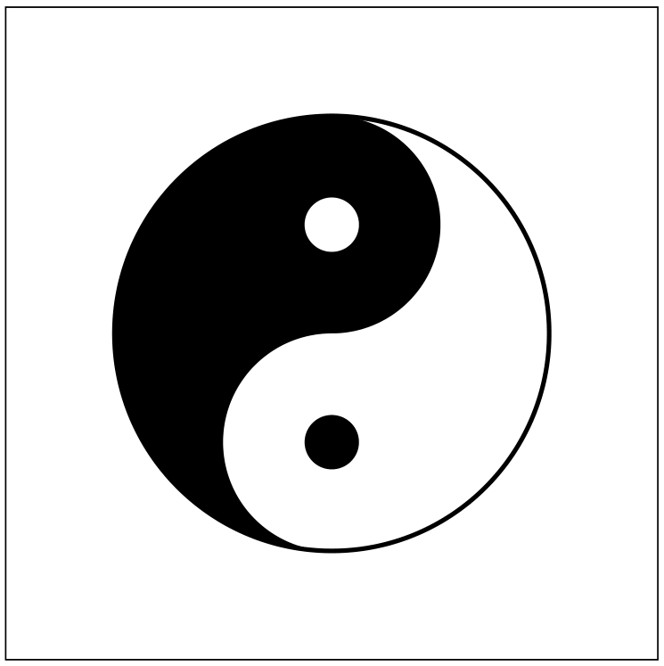

# Problem 3

Your task in this problem is to recreate the classic yin-yang symbol, centered in the middle of the screen, as seen below:

Given the shapes that we have introduced so far: rectangles, circles/ovals, and lines, recreating the above may seem impossible! But thinking through how you could overlay blocks of color atop one another should help you see a path forward. You can access an interactive visual [here](https://rembold-cs151-master.github.io/Section06_Supplementary/#/yin-yang) to help you. Once you have a plan and layering order figured out, implement it in code in the template file to recreate the image above. Doing so will mean carefully working out how to position the various shapes, so don't be afraid to draw it out on paper or a whiteboard!
